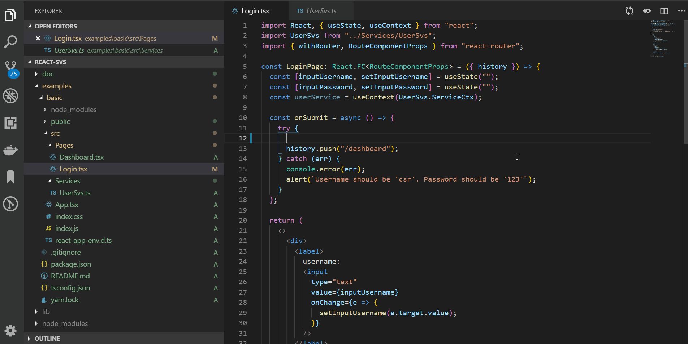
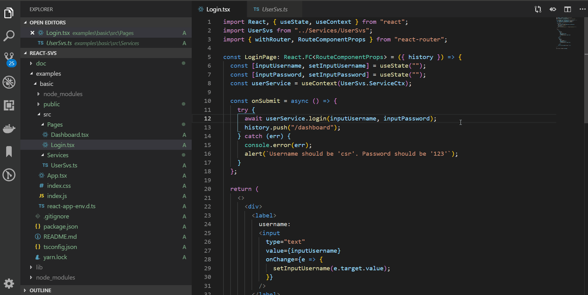
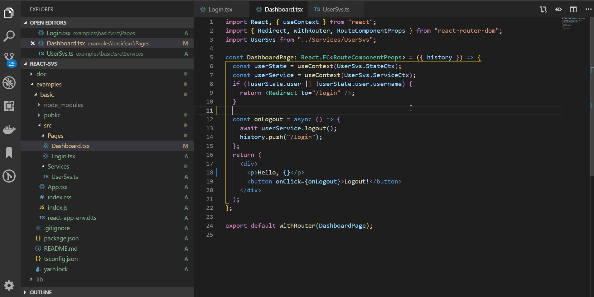
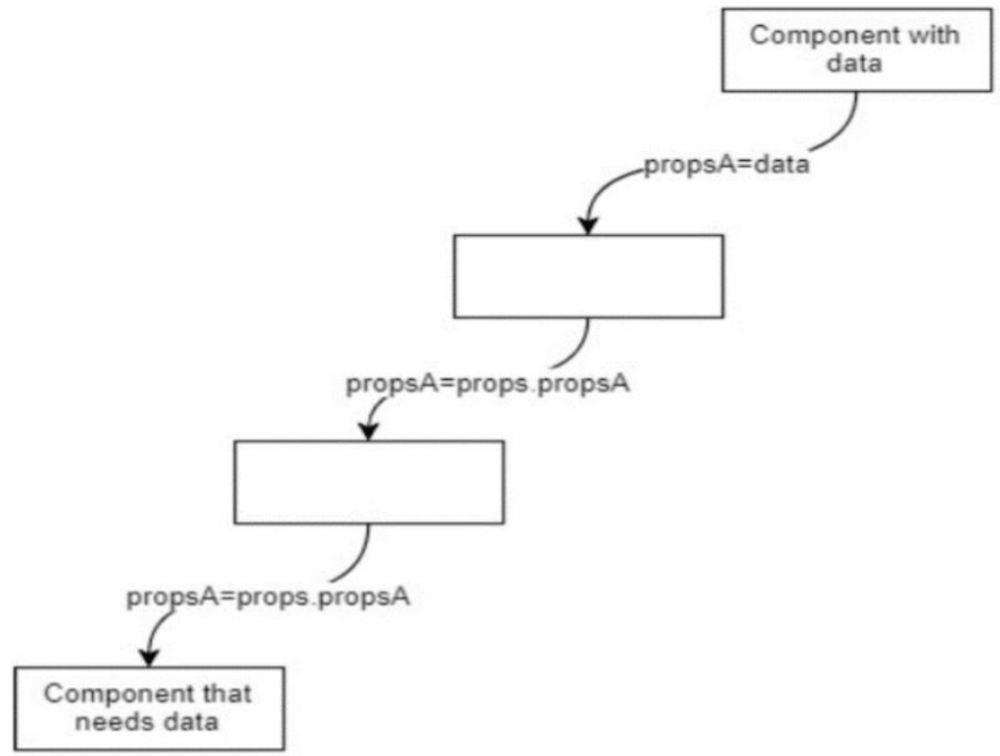

# React-Svs

React-Svs is a light-weight, type-safe state management tool for React. It is designed to achieve three goals:

1. **Share** state within a subtree of React components.
2. **Update** the shared state with predefined routines. Every React components within the subtree can call the update routines.
3. **Fully utilize Typescript**. When you are accessing the shared state, or calling the update routines, React-Svs will infer all the type info for you, so you can benefit from all the Typescript magic like intelliSense, type-checking and jump-to-definition.
   > The type inference is achieved mostly with these Typescript feature: [mapped types](https://www.typescriptlang.org/docs/handbook/advanced-types.html#mapped-types), [type inference in conditional types](https://www.typescriptlang.org/docs/handbook/advanced-types.html#type-inference-in-conditional-types).

## Demonstration

If you use React-Svs and Typescript, you can call state-updating routines in a type-safe manner. You can benefit from all the Typescript magic like intelliSense, type-checking and jump-to-definition:


You can refactor state-related code more easily and safely:

You can obtain data from shared state without worrying about typo in property names:


## Motivation

- Most React App need to share state between components. Passing state through props([Prop Drilling](https://hackernoon.com/lessons-learned-common-react-code-smells-and-how-to-avoid-them-f253eb9696a4#e988)) dosen't scale well.
  
  React 16.3.0 introduce new a Context API that allow a component to 'broadcast' data to it's component subtree.
  > React-Svs is implemented with [React Context API](https://reactjs.org/docs/context.html). That's why **every shared state is scoped within a React component subtree**.
- Redux introduces many constraints and complexity into a project. This is a trade-off to make code behaviour clear in large projects. But for middle-size and fast-iterate projects, this may be unnecessary. Read [You Might Not Need Redux](https://medium.com/@dan_abramov/you-might-not-need-redux-be46360cf367).
- Most state management tools don't utilize type info. The binding between **update call** and **update implementation** is determined during **runtime**. For example, when you emit the **update call**:`store.dispatch({ type: 'INCREMENT' })`, although you can easily know it will execute the `INCREMENT` part of the reducer(**update implementation**), IDE(typescript language server) can't learn about this without actually **executing** the code, because the update call and the update implementation is connected by a string(runtime value). So Typescript can't provide you with code completion and type-checking for the payload of `INCREMENT` action.

## Concepts

React-Svs is implemented with [React Context API](https://reactjs.org/docs/context.html). That's why **every shared state is scoped within a React component subtree**.

### State provider

A provider is a `Component` that:

1. Holds the shared state. It allow its descendants to subscribe it's state.
   > The state object is provided by React Context API.
2. Provides a service(which is an object having convenient/reusable routines)
   for its descendants to update it's state.
   > The service object is also provided by React Context API. (But with different context)

### State service

A service is an `Object` that:

1. Can call the Provider's `setState()` to update it's state.
2. Defines a group of convenient/reusable routines
   to **make async request, process data, and finally update its Provider's state**.

Provider and Service are **one-to-one**: One Provider component instance provides one Service instance.

## How to use

Generally, to use React-Svs, you need to:

1. `npm install --save react-svs`

2. Prepare a service and provider. Like this:

   ```tsx
   // UserSvs.ts
   import { ServiceBase, ServiceMixin } from "react-svs";

   async function fakeLogin(username: string, password: string) {
     // wait for 2s, simulating a network request
     await new Promise((res, rej) => {
       setTimeout(() => {
         res();
       }, 100);
     });
     if (username === "csr" && password === "123") {
       return { success: true, userId: 1 };
     } else {
       return { success: false };
     }
   }

   interface IUserState {
     user: { userId: number; username: string } | null;
   }

   const UserSvs = ServiceMixin(
     class extends ServiceBase({
       user: null
     } as IUserState) {
       public async login(username: string, password: string) {
         const { success, userId } = await fakeLogin(username, password);
         if (!success || !userId) throw new Error("login fail");
         this.setProviderState({ user: { username, userId } });
       }
       public async logout() {
         // wait for 2s, simulating a network request
         await new Promise((res, rej) => {
           setTimeout(() => {
             res();
           }, 100);
         });
         this.setProviderState({
           user: null
         });
       }
     }
   );

   export default UserSvs;
   ```

   Notice two things:

   1. You define a class for service, which contains state-updating routines. React-Svs will instantiate this class when a provider component is created, and bind these two objects.

   2. Call `ServiceMixin(ServiceClass)`.

3. Host the service. Put the `Provider` component generated by `ServiceMixin(ServiceClass)` somewhere in the react component tree. For example, if you want to share the state within the whole app, you can put the `Provider` in the root `App` component:

   ```tsx
   // App.tsx
   import React from "react";
   import { BrowserRouter as Router, Route, Switch } from "react-router-dom";
   import UserSvs from "./Services/UserSvs";
   import LoginPage from "./Pages/Login";
   import DashboardPage from "./Pages/Dashboard";

   function App() {
     return (
       <Router>
         {/* provide the user state and user service to this subtree */}
         <UserSvs.Provider>
           <div className="App">
             <Switch>
               <Route path="/login" component={LoginPage} />
               <Route path="/dashboard" component={DashboardPage} />
               <Route component={LoginPage} />
             </Switch>
           </div>
         </UserSvs.Provider>
       </Router>
     );
   }

   export default App;
   ```

4. Obtain/update the state in any component under the `Provider`. You use `ServiceCtx` and `StateCtx` generated by `ServiceMixin(ServiceClass)` to get service object and state object.

   ```tsx
   // Dashboard.tsx
   import React, { useContext } from "react";
   import { Redirect, withRouter, RouteComponentProps } from "react-router-dom";
   import UserSvs from "../Services/UserSvs";

   const DashboardPage: React.FC<RouteComponentProps> = ({ history }) => {
     const userState = useContext(UserSvs.StateCtx);
     const userService = useContext(UserSvs.ServiceCtx);
     if (!userState.user || !userState.user.username) {
       return <Redirect to="/login" />;
     }
     const onLogout = async () => {
       await userService.logout();
       history.push("/login");
     };
     return (
       <div>
         <p>Hello, {userState.user.username}</p>
         <button onClick={onLogout}>Logout!</button>
       </div>
     );
   };

   export default withRouter(DashboardPage);
   ```

There is a complete working example inside `examples/basic`.

## API

### ServiceBase

`ServiceBase` is used to create a base class that your service class should extends.
`ServiceBase` has shape like this:

```ts
type ServiceBase = (
  initialState: State,
  subscribeTo: SubscribeTo = {} as ISubscribeTo,
  defaultProviderProps: ProviderPropsType = {} as ProviderPropsType
) => IServiceConstructor;
```

#### initialState

This parameter is used to init the Provider component's state. Also, this parameter decides the type of state. React-Svs will use this type info to infer the type of many value.

When defining the service class, you can use `this.providerState` to get the current state of Provider and you can use `this.setProviderState` to update the state. The usage of `this.setProviderState` is same as [setState](https://reactjs.org/docs/react-component.html#setstate) of normal React component.

#### subscribeTo

A Provider can subscribe other React context! As many as you want! Just pass those contexts within this parameter. `ISubscribeTo` has shape like this:

```ts
interface ISubscribeTo {
  readonly [key: string]: React.Context<any>;
}
```

When defining the service class, you can use `this.subscribedData` to get the context data you subscribe.

#### defaultProviderProps

Like any other normal React component, a Provider can communicate with it's parent through props. When defining the service class, you can use `this.providerProps` to get the props that the Provider component received.

This parameter define the default props of Provider if its parent didn't pass props to it. Also, this parameter decides the type of Provider's props. React-Svs will use this type info to infer the type of many value.

### ServiceMixin

`ServiceMixin` is used to generate Provider and React context objects from service class. Remember, the service class should extends the base class returned by `ServiceBase`, like the above example.

```ts
type ServiceMixin = (
  ServiceConstructor: ServiceConstructor
) => ExtendedServiceConstructor;
```

The `ExtendedServiceConstructor` is a class that extends ServiceConstructor, with these additional **static readonly** member:

1. `Provider`. This is the Provider(a react component class). You should put this component somewhere in the react component tree, so the **subtree** under it can obtain/update it's state.
2. `withProvider`. This is just a suger method that return a HOC to mount `Provider`. You can do `const MyComponentWithProvider = withProvider(MyComponent)` so that `Provider` will be mounted above `MyComponent`.
3. `ServiceCtx`. This is a React Context Object(created by [React.createContext](https://reactjs.org/docs/context.html#reactcreatecontext) internally). This context provide the state service. The components that want to update the shared state shoud subscribe this.
4. `StateCtx`. This is a React Context Object(created by [React.createContext](https://reactjs.org/docs/context.html#reactcreatecontext) internally). This context provide the state. The components that want to obtain the shared state shoud subscribe this.
